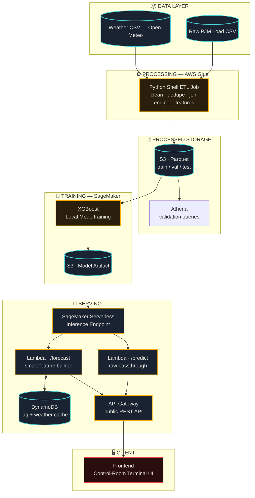

# PJM East Load Forecasting — End-to-End ML + AWS Pipeline

A day-ahead electricity load forecasting system for the PJM East grid region,
built as a full production-style pipeline: raw data → cleaned & feature-engineered
storage → trained model → deployed inference API → interactive terminal-style
frontend. Every layer runs on AWS, sized deliberately to stay near-zero cost
between uses.

**Live demo:** [add your deployed frontend URL here]
**API:** `https://es7ix1oeoe.execute-api.us-east-1.amazonaws.com/prod/forecast`

<p>
  
  
  
  
</p>
<p>
  
  
  
  
  
  
  
  
</p>
<p>
  
  
</p>

---

## What it does

Given a target date and hour, predicts the electricity load (MW) that PJM East
will draw — the kind of forecast grid operators run daily for generation
scheduling, day-ahead price setting, and reserve margin planning.

```
POST /forecast
{"datetime": "2017-07-15T14:00:00"}

→ {"datetime": "2017-07-15T14:00:00", "prediction_mw": 39952.8}
```

Valid range: **2017-01-08 → 2018-08-03** (bounded by seeded historical cache — see [Limitations](#limitations)).

---

## Results

| Metric | Naive baseline (t-168h) | XGBoost, no weather | XGBoost + weather fusion |
|---|---|---|---|
| Val MAE | 3,446.6 MW | 1,786.4 MW | **1,050.7 MW** |
| Val MAPE | 10.92% | 5.68% | **3.40%** |
| Test MAPE (unseen 2018 data) | — | — | **3.53%** |

- Final model generalizes cleanly — only a 0.14pp gap between val and test MAPE
- Published day-ahead load forecasting benchmarks typically target 2–5% MAPE in
  industry — this result lands solidly in that range
- **Weather fusion was the single biggest lever**, larger than hyperparameter
  tuning. A 24-config hyperparameter sweep found the model had already hit a
  performance ceiling (0.8% MAE improvement, within noise) *before* weather
  was added — full sweep results in `docs/hyperparameter_sweep_results.csv`

**Seasonal MAE improvement from weather fusion** (matches the physical
intuition that temperature drives AC/heating-related demand volatility):

| Season | Before weather | After weather | Change |
|---|---|---|---|
| Summer | 2,250 MW | 1,306 MW | −42% |
| Winter | 1,850 MW | 919 MW | **−50%** |
| Fall | 1,460 MW | 1,028 MW | −30% |
| Spring | 1,530 MW | 949 MW | −38% |

- Feature importance shifted accordingly: `cdd` (cooling degree hours) became
  the 2nd most important feature overall
- Weather features combined account for ~30% of total model importance — up
  from 0% in the pre-weather model

---

## Architecture



**Services used:** S3 · Glue · Athena · SageMaker (Training + Serverless
Inference) · Lambda · API Gateway · DynamoDB · IAM · CloudWatch

**Pipeline in short:**
1. Raw load + weather CSVs land in S3
2. Glue (Python Shell) cleans, joins, and engineers features → Parquet in S3
3. Athena validates the processed data
4. SageMaker trains XGBoost (Local Mode — see [Limitations](#limitations))
5. Model deployed to a **Serverless** Inference endpoint
6. Two Lambda + API Gateway routes: `/predict` (raw feature vector) and `/forecast` (just a timestamp — Lambda builds features from a DynamoDB cache)
7. Static frontend calls `/forecast` directly

---

## Key engineering decisions

- **Glue Python Shell over Spark** — the dataset is ~12MB / 145K rows;
  Spark's distributed processing is unwarranted overhead. Sized the tool to
  the data, not the other way around.

- **SageMaker Local Mode for training** — hit a `ResourceLimitExceeded` quota
  wall on a fresh AWS account (0 default training-instance quota, both
  on-demand and spot). Rather than wait on quota approval, used Local Mode to
  run the exact same containerized training script directly on the notebook
  instance via Docker — validating the real training path with zero quota
  dependency.

- **Serverless Inference over a real-time endpoint** — scales to ~zero and
  bills per-invocation, avoiding the idle hourly cost of an always-on
  endpoint. Tradeoff: cold-start latency (~15–20s) on the first request after
  idle.

- **DynamoDB schema** — partition key `region` (constant), sort key
  `datetime`. This enables fetching an entire 168-hour lookback window in a
  single `Query` call using a range condition, instead of 168 individual
  lookups.

- **No live data feed** — this is a portfolio project built on a static
  Kaggle dataset (2002–2018). DynamoDB is seeded from historical val/test
  data to demonstrate the caching architecture, not backed by a real PJM
  telemetry feed. As a result:
  - `/forecast` only accepts datetimes between **2017-01-08 and 2018-08-03**
    (needs 168h of lookback history + a cached weather value for the target hour)
  - `/predict` accepts any input, since the caller supplies the full feature
    vector directly

- **Batch automation (EventBridge + SNS) was scoped out.** A daily "predict
  next 24 hours + email report" pipeline only makes sense against a live,
  advancing data feed — anchoring it to a fixed historical date would just
  produce the same forecast every run. Real-world PJM load data is available
  via PJM Data Miner 2 (requires separate API registration + a scheduled
  ingestion Lambda) — flagged as a natural next step rather than built, given
  the ongoing infrastructure cost for a feature that wouldn't demo
  meaningfully without it.

- **Step Functions was not used**, for the same reason batch automation was
  dropped — with no live-data orchestration need, a single sequential Lambda
  covers the workflow without added orchestration overhead.

---

## Limitations

- **No live data feed** — DynamoDB is seeded from historical data (2017–2018), so `/forecast` only works within that range. `/predict` accepts any input since you supply the feature vector yourself.
- **Batch daily-email automation was designed but not deployed** — doesn't make sense without a live data feed advancing the "today" anchor. Real-world PJM data is available via PJM Data Miner 2; flagged as a natural next step.
- **Local Mode training** — hit a 0-quota wall on training instances (fresh AWS account); trained via SageMaker's Local Mode (Docker on the notebook instance) instead of a real training job.
- **Cold-start latency** — Serverless Inference endpoint has a ~15–20s cold start on the first request after idle.

---

## Repo structure

```
pjm-load-forecasting/
├── README.md
├── requirements.txt
├── data/
│   ├── raw/
│   │   ├── PJME_hourly.csv
│   │   └── weather_philadelphia.csv
│   └── processed/
├── notebooks/
│   ├── 01_baseline_modeling.ipynb
│   ├── 02_hyperparameter_sweep.ipynb
│   ├── 03_weather_fusion_evaluation.ipynb
│   └── 04_training_and_deployment.ipynb
├── glue_jobs/
│   └── etl_pjme_clean_and_split_v2.py
├── src/
│   └── training/
│       ├── train_entry.py
│       └── train_requirements.txt
├── lambda/
│   ├── predict_handler/            (raw passthrough)
│   │   └── app.py
│   ├── smart_predict_handler/      (/forecast — DynamoDB feature building)
│   │   └── app.py
│   └── inference.py                (SageMaker inference handler)
├── scripts/
│   ├── fetch_weather_data.py
│   └── seed_dynamodb.py
├── frontend/
│   └── index.html
└── docs/
    ├── mae_by_hour.png
    ├── mae_by_hour_weather_fusion.png
    ├── mae_by_season.png
    ├── mae_by_season_weather_fusion.png
    ├── feature_importance.png
    ├── feature_importance_with_weather.png
    ├── hyperparameter_sweep_results.csv
    ├── cost_breakdown.md
    └── screenshots/
        ├── 01-s3-buckets-overview.png
        ├── 02-s3-model-artifacts.png
        ├── ...
        └── 15-jupyter-file-browser.png
```

---

## Cost profile

- Everything here is either **serverless-and-pay-per-use** (Lambda, API
  Gateway, SageMaker Serverless Inference, DynamoDB on-demand) or
  **ephemeral** (Glue job runs, SageMaker training)
- Nothing sits idle racking up hourly charges
- The whole pipeline can stay live indefinitely for a few cents/month in
  storage, with actual invocations costing fractions of a cent each
- Full breakdown in `docs/cost_breakdown.md`

---

## Dataset

- Load: [PJM Hourly Energy Consumption](https://www.kaggle.com/datasets/robikscube/hourly-energy-consumption) (Kaggle)
- Weather: [Open-Meteo Historical Archive](https://open-meteo.com/) (Philadelphia, PA — proxy for PJM East region)

---

## License

MIT — see [LICENSE](LICENSE)
